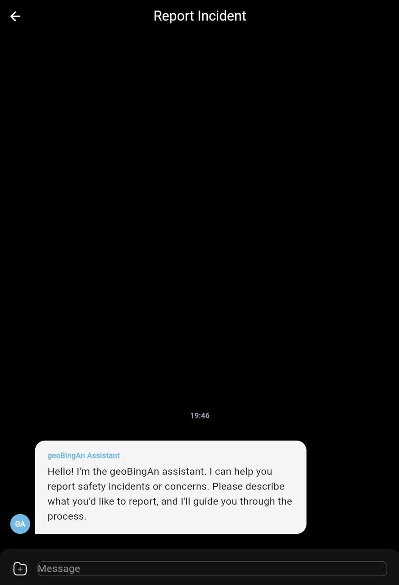
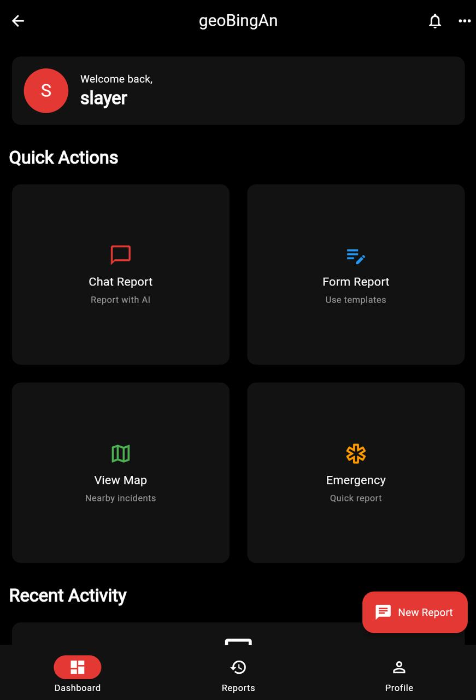

# geoBingAn v2 Mobile App

A Flutter mobile application for iOS, Android, and Web that enables natural language incident reporting with AI assistance.

<p align="center">
  
</p>

## Screenshots

<p align="center">
  
  
  
</p>

## Features

- **Natural Language Chat Interface**: Report incidents by having a conversation with AI
- **Gemini AI Integration**: Intelligent conversation processing and report extraction
- **Multiple Authentication Methods**: 
  - Local account registration and login
  - Google OAuth (requires backend configuration)
  - LINE and Facebook OAuth (coming soon)
- **Multi-language Support**: Traditional Chinese, Simplified Chinese, and English
- **Dark/Light Theme**: Black and white based design with red accent color
- **Real-time Report Submission**: Seamless integration with geoBingAn v2 backend API
- **Secure Token Management**: JWT authentication with automatic refresh

## Architecture

The app follows a clean architecture pattern with:
- **Feature-based organization**: Each feature has its own presentation, domain, and data layers
- **State Management**: Flutter Riverpod for reactive state management
- **API Integration**: Dio for HTTP requests with token refresh and caching
- **Secure Storage**: Flutter Secure Storage for sensitive data

## Setup

1. **Prerequisites**
   - Flutter SDK 3.0+
   - Dart SDK 3.0+
   - Chrome browser (for web development)
   - Android Studio or Xcode (for mobile development)
   - geoBingAn v2 backend running locally or deployed

2. **Backend Setup**
   - Clone and run [geoBingAn_v2_backend](https://github.com/GeoThings/geoBingAn_v2_backend)
   - Ensure the backend is running on `http://localhost:8000`
   - For Google OAuth, configure OAuth client_id in backend settings

3. **Environment Configuration**
   The `.env` file is already configured with:
   ```
   API_BASE_URL=http://localhost:8000/api
   GEMINI_API_KEY=<configured>
   GOOGLE_MAPS_API_KEY=<configured>
   ```
   Update `API_BASE_URL` if your backend runs on a different URL.

4. **Installation**
   ```bash
   # Install dependencies
   flutter pub get
   
   # Run code generation (if needed)
   flutter pub run build_runner build
   ```

5. **Run the app**
   ```bash
   # For web (recommended for development)
   flutter run -d chrome
   
   # For iOS Simulator
   open -a Simulator
   flutter run
   
   # For Android Emulator
   flutter run -d android
   
   # List all available devices
   flutter devices
   ```

## Project Structure

```
lib/
├── core/
│   ├── config/         # App configuration
│   ├── services/       # Core services (API, Gemini, Storage)
│   └── theme/          # App theme definitions
├── features/
│   ├── auth/           # Authentication feature
│   ├── chat/           # Chat & AI interaction
│   └── home/           # Home dashboard
└── main.dart           # App entry point
```

## Key Components

### Chat Interface
- Powered by `flutter_chat_ui` for a polished messaging experience
- Real-time AI responses using Gemini Pro
- Support for attachments (images, location, files)
- Automatic report data extraction from conversations

### Authentication
- Google OAuth 2.0 integration
- Token-based authentication with automatic refresh
- Secure token storage

### Report Submission
- Converts natural language to structured reports
- Extracts key information: location, time, severity, description
- Submits to backend in geoBingAn v2 format

## Development

### Adding New Features
1. Create a new feature folder under `lib/features/`
2. Implement presentation, providers, and services
3. Add routes in `main.dart`

### API Integration
- All API calls go through `ApiService` with automatic token handling
- Add new endpoints in `lib/core/services/api_service.dart`

### Theming
- Theme colors and styles defined in `lib/core/theme/app_theme.dart`
- Black/white base with red accent (#E53935)

## Contributing

Please follow the existing code patterns and ensure:
- Product name is always `geoBingAn` (lowercase 'g')
- Maintain black/white/red color scheme
- Test on both iOS and Android platforms

## License

Private repository - All rights reserved